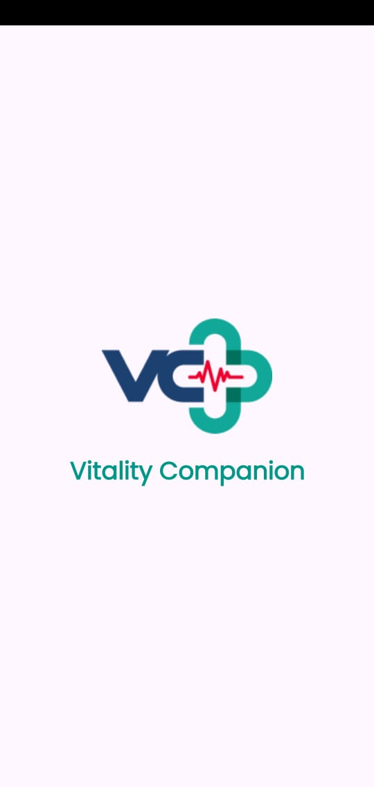
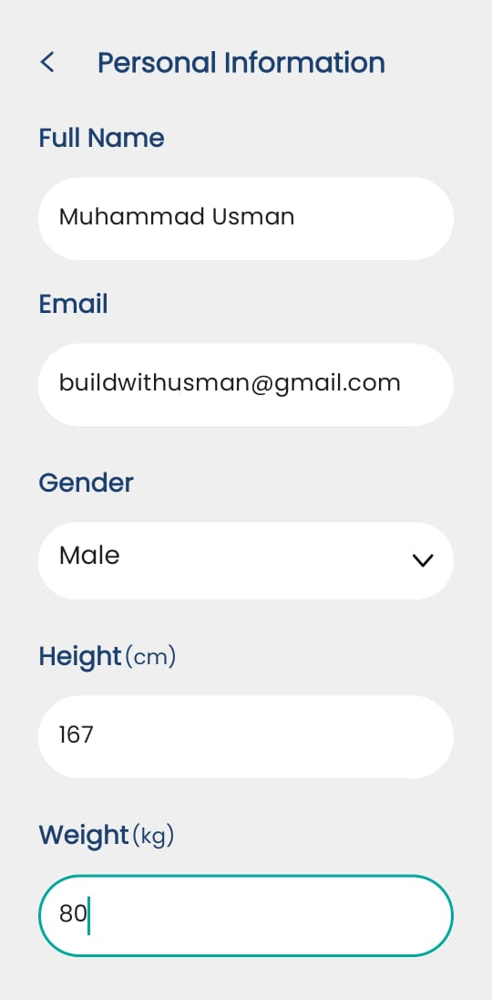
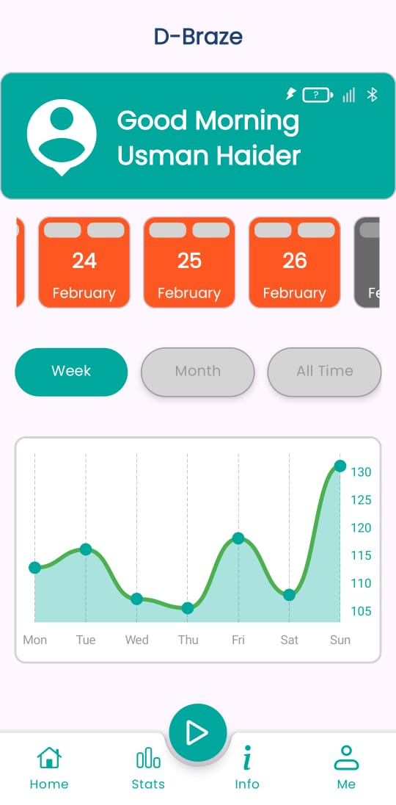
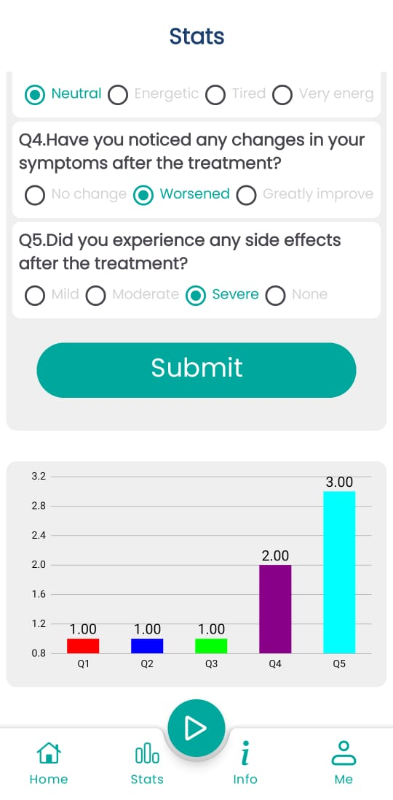
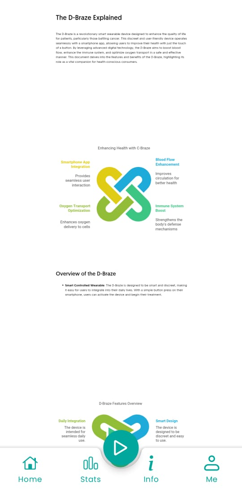
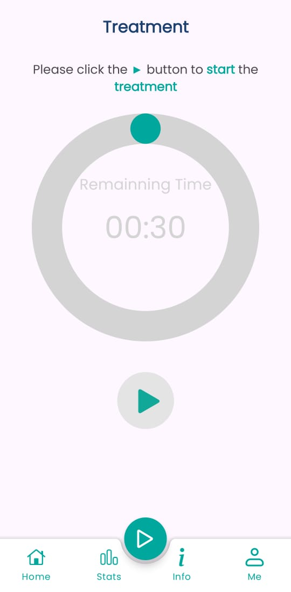

<div align="center">

# Real-Time BLE Health Monitor

### A production-grade Android health monitoring app with BLE wearable integration

[](https://developer.android.com)
[](https://kotlinlang.org)
[](https://firebase.google.com)
[-blue?style=for-the-badge)](https://developer.android.com/about/versions/nougat)
[-green?style=for-the-badge)](https://developer.android.com/about/versions/15)
[](https://developer.android.com/topic/architecture)
[](LICENSE)

</div>

---

## What This App Does

**Real-Time BLE Health Monitor** is a health companion Android application that bridges users with their BLE wearable devices (smartwatches, health bands) to track, monitor, and visualize personal health metrics in real time.

Users authenticate securely, pair their wearable over Bluetooth Low Energy, and access a personalized health dashboard — all within a smooth, Material Design 3 interface.

> Built to showcase production-level Android engineering: clean architecture, dependency injection, real-time hardware communication, and cloud-backed authentication — the same stack powering apps at Fortune 500 companies.

---

## Key Features

| Feature | Description |
|---|---|
| **BLE Device Pairing** | Scans, discovers, and connects to Bluetooth Low Energy health wearables with GATT protocol |
| **Real-Time Health Metrics** | Reads live battery voltage, charging state, and sensor data from paired devices |
| **Firebase Authentication** | Secure email/password auth with forgot password and account creation flows |
| **Cloud Profile Storage** | User health profile (height, weight, DOB, gender) persisted to Firestore with merge writes |
| **Health Dashboard** | Bottom-nav driven dashboard with Home, Stats, Info, and Profile tabs |
| **Animated Onboarding** | Lottie-powered splash and pairing screens for polished first impressions |
| **Permission-Aware BLE** | Handles Android 12+ Bluetooth permission model (BLUETOOTH_SCAN, BLUETOOTH_CONNECT) |
| **Multi-Step Registration** | Guided sign-up collecting personal health data with live input validation |

---

## Screenshots & Demo

<div align="center">

### Demo Video

<video src="https://github.com/buildwith-Usman/Real-time-BLE-Health-Monitoring-Android/releases/download/v1.0/demo_video.mp4" controls width="100%"></video>

### Onboarding & Sign Up

| Splash | Sign Up |
|:---:|:---:|
|  |  |

### Dashboard & Health Monitoring

| Home | Stats | Info |
|:---:|:---:|:---:|
|  |  |  |

### Bluetooth Pairing

| BLE Device Pairing |
|:---:|
|  |

</div>

---

## Architecture

This project follows **MVVM + Clean Architecture** principles — the same pattern used in enterprise Android codebases.

```
com.app.dbraze/
├── base/                    # Generic BaseActivity, BaseFragment, BaseViewModel
├── data/
│   └── repository/          # AuthRepository, UserRepository, BluetoothManager
├── di/                      # Hilt modules: Firebase, Bluetooth, Repository, Network
├── presentation/
│   ├── model/               # Data classes (UserModel with Firestore serialization)
│   ├── ui/
│   │   ├── activities/      # Splash, Start, Dashboard host activities
│   │   ├── fragment/        # 9 feature fragments
│   │   └── services/        # BluetoothLeService (background BLE)
│   ├── viewmodel/           # 13 ViewModels (one per screen + shared)
│   └── views/               # GenericAdapter<T,VB>, CircularAnimation
└── utils/                   # InputValidator, PermissionUtils, DialogUtils, Extensions
```

**Why this matters:** Every layer is independently testable, every dependency is injected, and the UI never talks directly to data sources — the hallmark of scalable, maintainable Android code.

---

## Tech Stack

### Core Android
| Technology | Version | Purpose |
|---|---|---|
| Kotlin | 1.9.24 | Primary language |
| Android Gradle Plugin | 8.4.0 | Build tooling |
| View Binding | — | Type-safe view access |
| Navigation Component | 2.8.2 | Fragment-based routing with Safe Args |
| Lifecycle + ViewModel | 2.8.6 | Lifecycle-aware state management |
| Coroutines | — | Async BLE and Firebase operations |

### Dependency Injection
| Technology | Version | Purpose |
|---|---|---|
| Dagger Hilt | 2.47 | App-wide DI with scoped singletons |

### Firebase / Backend
| Technology | Version | Purpose |
|---|---|---|
| Firebase BOM | 33.4.0 | Dependency management |
| Firebase Auth | — | Email/password authentication |
| Firebase Firestore | — | Cloud user profile storage |
| Firebase Analytics | — | Usage insights |

### UI / UX
| Technology | Version | Purpose |
|---|---|---|
| Material Design 3 | 1.12.0 | Modern UI components |
| Lottie | 6.0.0 | JSON-based animations |
| ConstraintLayout | 2.1.4 | Responsive UI layouts |
| SplashScreen API | 1.0.1 | Android 12+ splash screen |

### Bluetooth
| Technology | Purpose |
|---|---|
| Android BLE APIs | Device scanning, GATT connection, characteristic reads |
| BluetoothLeService | Background service with LocalBinder pattern |
| UUID filtering | Targeted device discovery (service UUID + battery characteristic UUID) |
| JSON data parsing | Real-time battery voltage, LED, and charger state from device payload |

---

## App Flow

```
Splash (2s) ─────────────────────────────────────────────────────────────
     │
     ├─ Authenticated ──► Dashboard (Bottom Nav: Home · Stats · Info · Profile)
     │                              └── Bluetooth Pairing (FAB)
     │
     └─ Not Authenticated ──► Welcome
                                  ├──► Login ──► Dashboard
                                  └──► Sign Up (Personal Info → Set Password) ──► Dashboard
                                            └──► Forgot Password (Reset Email)
```

---

## BLE Protocol

The app communicates with wearables using a custom BLE profile:

| Attribute | UUID |
|---|---|
| Service | `6e408975-b5a3-f393-e0a9-e50e24dcca9e` |
| Battery Characteristic | `6E400003-B5A3-F393-E0A9-E50E24DCCA9E` |

**Data Payload Format (JSON from device):**
```json
{
  "led": 1,
  "charger": 0,
  "bat_volt": 3.85
}
```

The app enables GATT notifications, subscribes to the battery characteristic, and parses incoming payloads in real time — enabling live health metric updates without polling.

---

## Getting Started

### Prerequisites
- Android Studio Hedgehog (2023.1.1) or later
- JDK 17+
- A physical Android device with Bluetooth (recommended for BLE testing)
- Google account for Firebase setup

### Firebase Setup
1. Create a Firebase project at [console.firebase.google.com](https://console.firebase.google.com)
2. Add an Android app with package `com.app.dbraze`
3. Download `google-services.json` and place it in `/app`
4. Enable **Email/Password** under Authentication → Sign-in methods
5. Enable **Cloud Firestore** in test mode

### Build & Run
```bash
# Clone the repository
git clone https://github.com/buildwith-Usman/Real-time-BLE-Health-Monitoring-Android.git
cd Real-time-BLE-Health-Monitoring-Android

# Open in Android Studio and sync Gradle
# Or build from CLI:
./gradlew assembleDebug

# Install on connected device
./gradlew installDebug
```

### Permissions Required
The app requests at runtime:
- `BLUETOOTH_SCAN` — to discover nearby BLE devices (Android 12+)
- `BLUETOOTH_CONNECT` — to establish GATT connections (Android 12+)
- `ACCESS_FINE_LOCATION` — required for BLE scanning on Android < 12

---

## Project Stats

| Metric | Value |
|---|---|
| Source files | 49 Kotlin files |
| Screens | 9 fragments + 3 host activities |
| ViewModels | 13 |
| Hilt DI modules | 4 (Firebase, Bluetooth, Repository, Network) |
| Min Android version | Android 7.0 (API 24) — covers 98%+ of active devices |
| Target Android version | Android 15 (API 36) |
| Build system | Gradle with Kotlin DSL (`.kts`) |

---

## What Makes This Production-Ready

- **No anti-patterns:** Zero hardcoded credentials, no God classes, no direct Fragment-to-Fragment dependencies
- **Memory-safe BLE:** Proper GATT cleanup and connection state management to prevent leaks
- **Lifecycle-aware:** All async operations cancel on lifecycle death via Coroutines + ViewModel scope
- **Input validation:** Client-side email, password (8+ chars), and field validation before any network call
- **Secure auth:** Passwords never stored locally; Firebase handles token refresh and session management
- **Firestore merge writes:** Profile updates never overwrite unrelated fields (`SetOptions.merge()`)
- **Generic RecyclerView adapter:** `GenericAdapter<T, VB>` eliminates boilerplate across all list UIs

---

## Roadmap

- [ ] Room Database — offline-first health data caching
- [ ] REST API integration (NetworkModule is scaffolded, ready for Retrofit)
- [ ] Heart rate and SpO2 metric visualization (charts)
- [ ] Notifications for health thresholds
- [ ] Unit and integration test coverage (JUnit + Mockk)
- [ ] CI/CD pipeline with GitHub Actions

---

## Author

**Muhammad Usman** — Android Engineer

Specialized in Kotlin, MVVM architecture, BLE integrations, and Firebase-powered mobile applications. Building apps that connect the physical and digital worlds.

- **LinkedIn:** [linkedin.com/in/build-with-usman](https://www.linkedin.com/in/build-with-usman/)
- **Email:** buildwithusman@gmail.com

---

> **Recruiters & Hiring Managers:** This project demonstrates hands-on experience with the Android stack used at companies like Google, Samsung Health, Fitbit, and Garmin — BLE protocol integration, clean architecture, Firebase ecosystem, and Material Design. Open to Senior Android Engineer roles. Let's connect.

---

<div align="center">

**If this project helped you or impressed you, consider giving it a ⭐**

</div>
